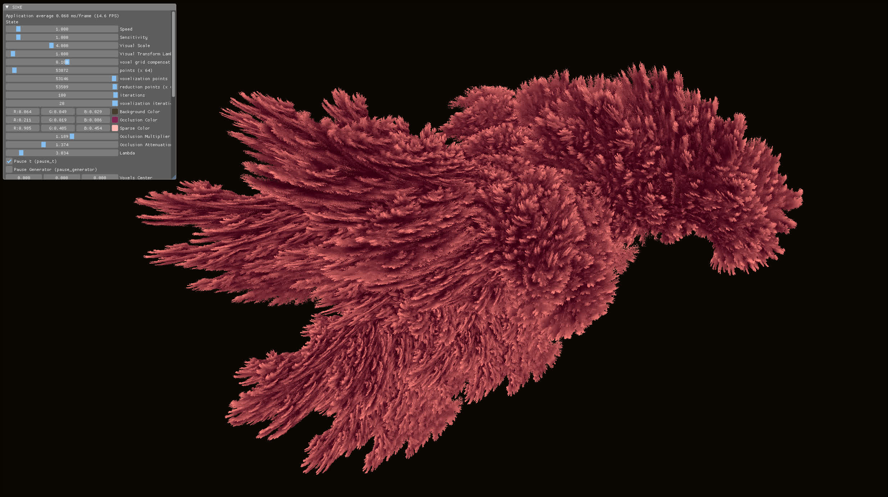
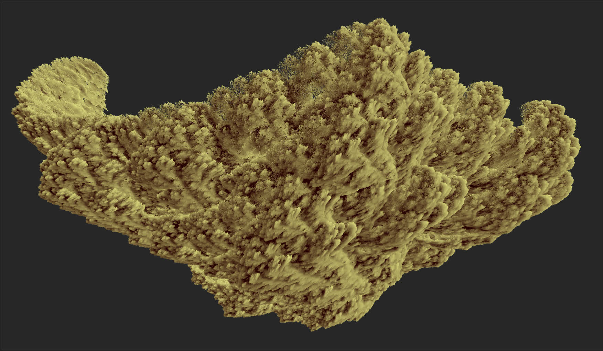
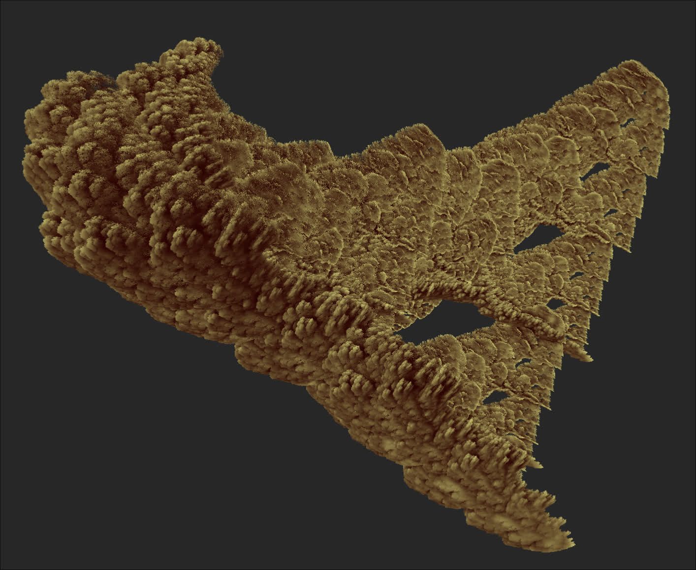
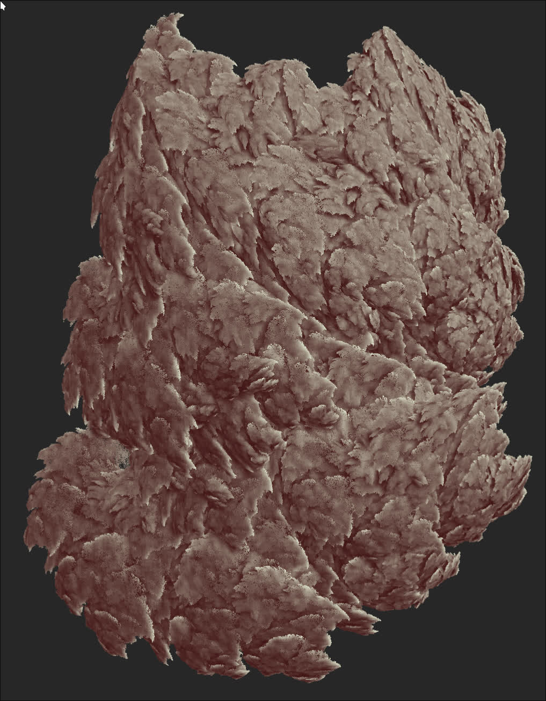
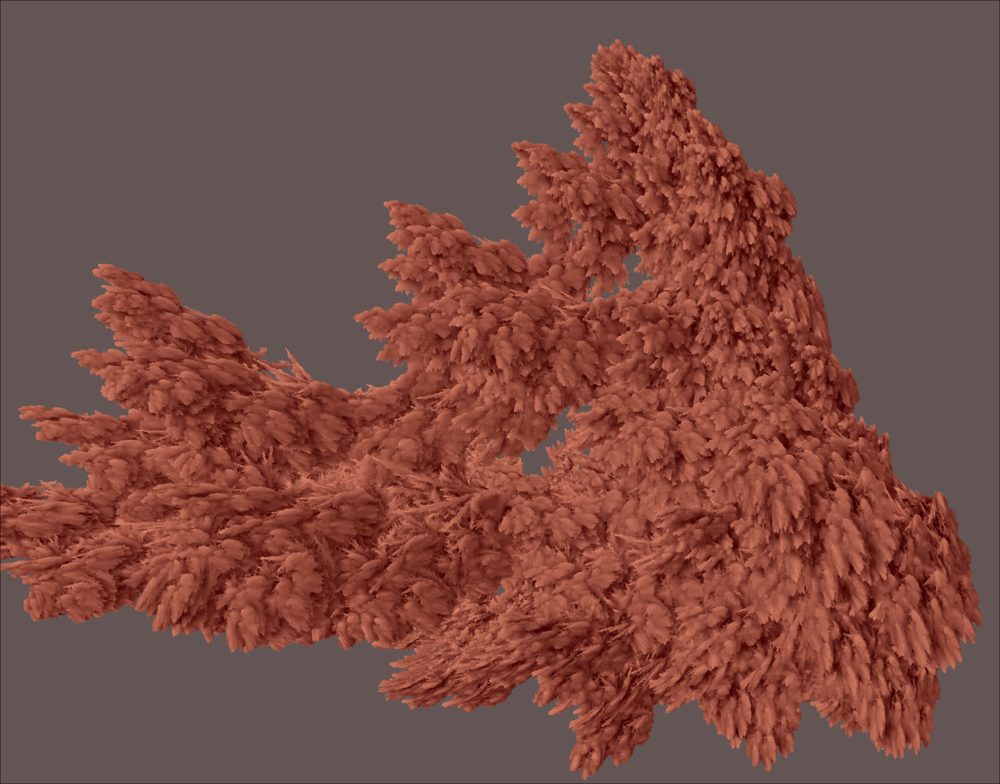

# Eyeface (IFS -- eyeface get it? hehe)
This project is a Vulkan implementation of Iterated Function Systems (IFS) point cloud fractals using compute shaders. The goal is to generate intricate fractal shapes by applying random transformations to a set of points iteratively. This approach uses Vulkan and compute shaders for high performance and real-time rendering.

The idea behind this project is inspired by [Acerola's video about IFS fractals](https://www.youtube.com/watch?v=1L-x_DH3Uvg)

# Check out a Demo video
Want to see it in action? Check out the demo on YouTube: [Eyeface demo](https://youtu.be/qpL7Qpi7AvY)

# Have a look at some screenshots

lookat these |  or maybe these
:--:|:--:
 | 
 | 

# Performance
This implementation can do 200 Million points at 30fps 2560x1600 on nvidia 4050 mobile.
but it looks acceptably good even at 12 million points. and starts having diminishing returns after 50-70 million points.

# How it works
The compute pipeline has a few passes
  - pass 1 clears all buffers that need to be cleared.
  - pass 2 applies a random transform to every point in the particle system once and is written back to the vertex buffer
  - pass 3 the bounds of the fractal are parallely calculated on the gpu using parallel reduction.
  - pass 4 each point is iterated a fixed number of times (say 10 times)
    - each iteration includes multiplication by a random transform and projection of the point on the screen
      and a voxel grid
    - a depth test is performed and the particle position is written to a screen buffer.
    - after projection to the voxel grid, a counter is incremented (in that voxel)
  - pass 5 calculates a naieve occlusion value by counting up voxels around each voxel.
  - pass 7 converts all particle positions in the screen buffer to the final colors of the fractal
      by sampling the occlusion grid and by performing some color mixing.

# instructions
The code is written in Zig 0.13. project depends on glfw and ImGui (both built from source in `build.zig`)
you might want to also install these libraries: fswatch imagemagick glslang shaderc
